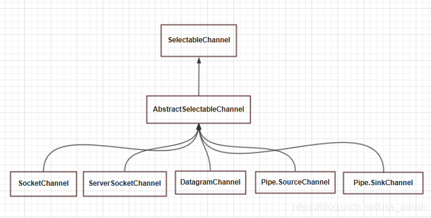

# java nio:

nio与传统io：

- nio面向缓冲区 buffer，io面向流 stream

- nio双向传输(基于channel)  ，io单向传输(需要构建输入流输出流)
- nio同步非阻塞式的  io同步阻塞式的

## 工作原理：

首先获取用于连接IO设备的通道channel以及用于容纳数据的缓冲区，利用选择器Selector监控多个Channel的IO状况（多路复用），然后操作缓冲区，对数据进行处理。

## 主要组件：

### **缓冲区（负责数据的存取）**：

主要的属性：

capacity：容量，表示缓冲区的最大容量，一旦声明就不能改变
limit：界限，缓冲区中可以操作数据的大小（limit后面的数据不能读写）
position：位置，表示缓冲区中正在操作数据的位置。
mark：标志，表示记录当前position的位置，可以通过reset()恢复到mark的位置。
四者的关系：0<mark<=position<=limit<=capacity

写数据时属性的变化：

1. 初始化时position位于数组首部，limit <= capacity

   

2. 向缓存区里写数据使得position指针向前移动

   

3. 写缓存操作结束调用**buffer.flip()**方法切换到读模式，此时position指针指向写数据开始时的位置，limit指向本次写操作结束的位置

   

4. 然后调用clear()方法将写入的数据刷新出去。这时底层操作系统就可以从缓冲区中正确读取这 5 个字节数据发送出去了。在下一次写数据之前我们在调一下 clear() 方法。缓冲区的索引状态又回到初始位置，即清空整个缓冲区。position将被设回0，limit被设置成 capacity的值

### 通道Channel（负责数据的运输）：

主要的实现类：

- FileChannel类：本地文件IO通道，用于**读取、写入、映射和操作文件的通道**。
- SocketChannel类：网络套接字IO通道，**TCP协议**，针对面向流的连接套接字的可选择通道（一般用在**客户端**）。
- ServerSocketChannel类：网络通信IO操作，**TCP协议**，针对面向流的监听套接字的可选择通道（一般用于**服务端**）。
- DatagramChannel类：针对面向数据报套接字的可选择通道，能够发送和接受UDP数据包的Channel。**UDP协议**.

获取通道：

1. Java 针对支持通道的类提供了 getChannel() 方法
            本地 IO：
            FileInputStream/FileOutputStream -> FileChannel
            RandomAccessFile

   ​		 网络IO：
    		Socket
    		ServerSocket
    		DatagramSocket

2.  在 JDK 1.7 中的 NIO.2 针对各个通道提供了静态方法 open() -> 直接调用通道类的静态方法返回该类型的channel
3.  在 JDK 1.7 中的 NIO.2 的 Files 工具类的 newByteChannel()

通道之间的数据传输

- transferTo(position，count，WritableByteChannel target) 

- transferFrom() 类似

通道的分散读取和聚集写入(写/读缓冲区中的数据)

- 分散读取：将通道的数据读取到多个缓冲区buffer中。方法：channel.read()：参数可以是某个缓冲区、带偏移量的缓冲区、多个缓冲区
- 聚集写入：将多个缓冲区的数据聚集写道通道channel中。方法：channel.write()。

### 选择器Selector（负责监控通道的IO状况）：



只有上图中的channel可以注册到Selector中

选择器使用步骤：

1. 创建selector
   通过调用Selector.open()方法创建一个Selector。
2. 向选择器注册通道
   注册之前，先**设置通道为非阻塞**的，channel.configureBlocking(false);然后再调用SelectableChannel.register(Selector sel,int ops)方法将channel注册到Selector中；其中ops的参数作用是**设置选择器对通道的监听事件**，ops参数的事件类型有四种（可以通过SelectionKey的四个常量表示）：
   （1）读取操作：SelectionKey.OP_READ,数值为1.
   （2）写入操作：SelectionKey.OP_WRITE,数值为4.
   （3）socket连接操作：SelectionKey.OP_CONNECT,数值为8.
   （4）socket接受操作：SelectionKey .OP_ACCEPT,数值为16.
   若注册时不止监听一个事件，可以使用“| 位或”操作符连接。

选择键SelectionKey：所有注册到Selector中的Channel集合

interest集合：用于指示选择器对管道关心的操作，可通过SelectionKey对象的interestOps()获取；最初，该兴趣集合是通过通道被注册到Selector时传进来的值。该集合不会被选择器改变，但是可以通过interestOps()改变

ready集合：通道已经就绪的操作的集合，表示一个通道准备好要执行的操作了，可通过SelectionKey对象的readOps()来获取相关通道已经就绪的操作。它是interest集合的子集，并且表示interest集合中从上次调用select()以后已经就绪的那些操作。

```java
Selector selector = Selector.open();
Set selectedKeys = selector.selectedKeys();
```

```java
int interestSet=selectionKey.interestOps();  //获取当前选择键感兴趣的channel集合
//判断这个集合是否对接收操作感兴趣
boolean isInterestedInAccept =(interestSet&SelectionKey.OP_ACCEPT)==SelectionKey.OP_ACCEPT
```

```java
int readSet=selectionKey.readyOps();//获取通道已经准备就绪的操作的集合
selectionKey.isAcceptable(); //检测Channel中接收是否就绪
```


## NIO代码示例：

```java
public void selector() throws IOException {
//先给缓冲区申请内存空间
        ByteBuffer buffer = ByteBuffer.allocate(1024);
     //打开Selector为了它可以轮询每个 Channel 的状态
        Selector selector = Selector.open();
    //获得一个服务端channel(使用TCP协议)
        ServerSocketChannel ssc = ServerSocketChannel.open();
        ssc.configureBlocking(false);//设置为非阻塞方式
        ssc.socket().bind(new InetSocketAddress(8080)); //
        ssc.register(selector, SelectionKey.OP_ACCEPT);//注册监听的事件
        while (true) {
             //取得所有key集合(即所有注册在selector中的channel)
            Set selectedKeys = selector.selectedKeys();
           
            Iterator it = selectedKeys.iterator();
            while (it.hasNext()) {
                SelectionKey key = (SelectionKey) it.next();
                //监听到接收缓冲有数据
                //int readyOps()   获取通道已经准备就绪的操作的集合
                //准备好的监听接收操作的channel(监听到其他客户端连接请求)
                if ((key.readyOps() & SelectionKey.OP_ACCEPT) == SelectionKey.OP_ACCEPT) {
                    ServerSocketChannel ssChannel = (ServerSocketChannel) key.channel();
                    //accept()方法在接收到链接之前会阻塞住，因为已经监听到连接请求，这一步不会阻塞
                 	SocketChannel sc = ssChannel.accept();//接受到服务端的请求
                    sc.configureBlocking(false);
                    //允许客户端连接读取数据
                    sc.register(selector, SelectionKey.OP_READ);
                    it.remove();
                } else if 
                    //准备好的监听读取数据请求的channel(监听到读取数据事件)
                ((key.readyOps() & SelectionKey.OP_READ) == SelectionKey.OP_READ) {
                    SocketChannel sc = (SocketChannel) key.channel();
                    while (true) {
                  
                        buffer.clear();
                        int n = sc.read(buffer);//读取数据到channel
                        if (n <= 0) {
                            break;
                        }
                        buffer.flip();
                    }
                    it.remove();
                }
            }
        }
}
```


